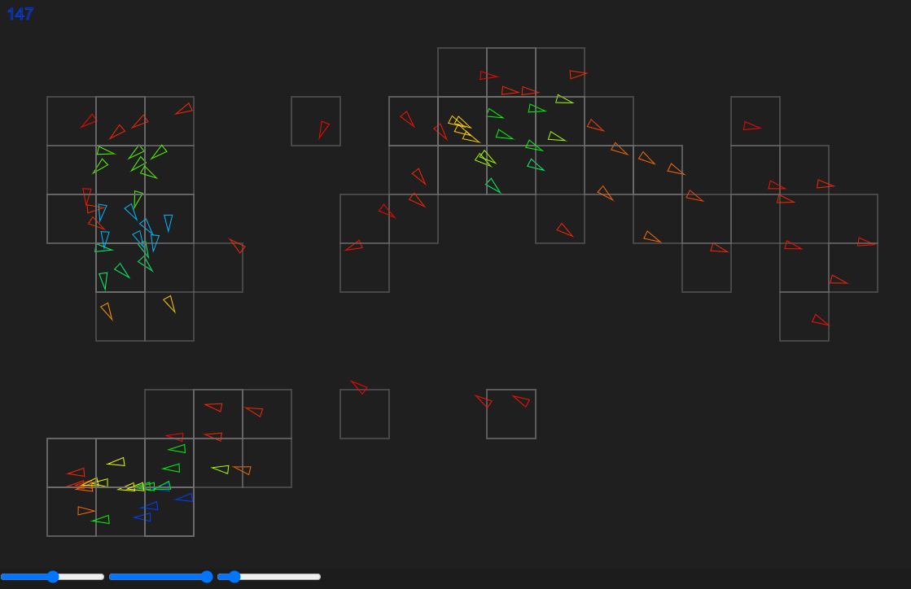
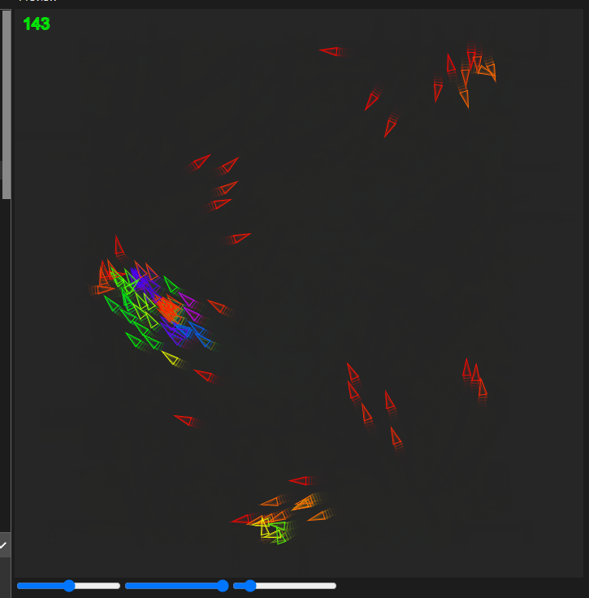
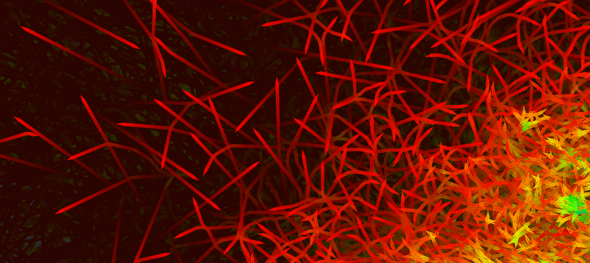

# Boids-Simulation

This recreation was made with the p5js editor and therefore does not have all the necessary code files to run standalone. You could however copy and paste the code into the online editor, or view this
[demo](https://editor.p5js.org/BenMaltby/full/E_LRLKP8S).

I found this algorithm quite difficult to get correct. I found that there were so many ways to tweak the sliders and have different effects so finding a configuration that best mimicked birds or fish was quite difficult. That's why after some time the boids will become very tightly packed, which is also affected by the chunk size. I used a chunking data structure because I thought it would be a necessary optimization if I wanted to have several hundred Boids, it definitely helped but there were some places where I kind of shot myself in the foot and made it less efficient. 

## Images

### *A cool image that came from some messed-up parameters*

